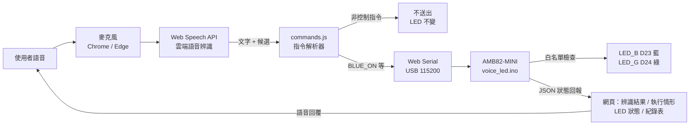

# 語音控制 LED 系統：AMB82-MINI × Vibe Coding

使用者對電腦說「左邊開燈」或「右邊開燈」，瀏覽器先把語音辨識成文字，再轉成指令，透過 **USB 序列埠**送到 **Realtek AMB82-MINI**，控制板上的藍燈與綠燈。板子執行後會回傳 JSON，網頁上顯示的 LED 狀態就以這份回報為準。

| 項目 | 內容 |
|---|---|
| 開發板 | Realtek **AMB82-MINI**（AmebaPro2 / RTL8735B），FQBN `realtek:AmebaPro2:Ameba_AMB82-MINI` |
| 藍燈（左邊） | `LED_B` = `AMB_D23`，**HIGH 亮 / LOW 滅** |
| 綠燈（右邊） | `LED_G` = `AMB_D24`，**HIGH 亮 / LOW 滅** |
| 腳位出處 | Realtek Core 4.1.1-build20260915 `variants/ameba_amb82-mini/variant.h` |
| 語音辨識 | 瀏覽器 Web Speech API（Chrome / Edge），辨識在雲端執行，支援 zh-TW 與 en-US |
| 通訊 | USB 序列埠 115200 bps，瀏覽器以 Web Serial API 直接存取，每行一個文字指令 |

## 系統架構



## 專案結構

```
voice_led/voice_led.ino             AMB82-MINI 韌體（序列埠指令 + LED 控制 + 閃爍狀態機）
web/index.html, app.js, style.css   控制介面（語音辨識、Web Serial 通訊、狀態顯示、紀錄匯出）
web/commands.js                     語音文字 → 指令的解析器 + 測試案例
web/test.html                       解析器自我測試頁
scripts/amb82.ps1                   編譯 / 燒錄 / 序列埠監控
scripts/serve.ps1                   以 http://localhost:8000 提供網頁（免安裝 Python/Node）
docs/REPORT.md                      報告草稿（架構、操作、AI 協作紀錄、心得）
docs/DEMO_SCRIPT.md                 示範影片與驗收腳本
clap/, alarm/, amb82_control/       之前的練習
```

## 執行環境

- Windows 10/11、VS Code
- Arduino CLI 1.5.1：`scripts/amb82.ps1` 依序尋找 `%LOCALAPPDATA%\Arduino15\cli\arduino-cli.exe`，以及 Arduino IDE 內建的 `arduino-cli.exe`（`C:\Program Files\Arduino IDE\...` 或 `%LOCALAPPDATA%\Programs\arduino-ide\...`），有安裝 Arduino IDE 2 就能直接用
- Realtek AmebaPro2 Arduino Core **4.1.1-build20260915**
  - Board Manager URL：`https://github.com/Ameba-AIoT/ameba-arduino-pro2/raw/main/Arduino_package/package_realtek_amebapro2_index.json`
- Microsoft Edge 或 Google Chrome（Web Speech API 與 Web Serial 需要這兩種瀏覽器；`serve.ps1` 會優先開 Chrome，沒有就開 Edge）
- 語音辨識服務需要網路連線
- AMB82-MINI 以 USB 線接電腦，本機為 **COM6**（裝置管理員顯示為 `USB-SERIAL CH340`）。COM 編號不同時，請修改 `.vscode/tasks.json` 與 `.vscode/arduino.json`。注意不要選到「透過藍牙連結的標準序列」，那是藍牙序列埠，不是開發板

> Realtek 的 Windows 建置工具不支援路徑中有中文，所以編譯暫存放在 `%LOCALAPPDATA%\Arduino15\build\<sketch>`。

## 操作步驟

### 1. 編譯與燒錄
1. VS Code → `Terminal` → `Run Task…` → **Voice LED: Build**
2. 讓板子進入燒錄模式：按住 **UART_DOWNLOAD** → 按一下 **RESET** → 放開 **UART_DOWNLOAD**
3. 執行 **Voice LED: Upload to COM6**
4. 燒錄完成後按一次 **RESET**

（選做）開啟 **AMB82: Serial Monitor (COM6, 115200)**，輸入 `BLUE_ON`、`GREEN_ON`、`STATUS` 等指令，單獨測試韌體。**測完一定要關閉監控視窗**，否則網頁無法使用 COM6。

### 2. 開啟控制介面
執行 **Voice LED: Web UI (localhost:8000)**，或 `powershell -ExecutionPolicy Bypass -File scripts\serve.ps1`，瀏覽器會自動打開 `http://localhost:8000/`。

1. 按「連線開發板」，從清單選擇 AMB82-MINI 的 COM 埠。之後重新整理頁面或重插 USB，網頁都會自動重新連線。
2. 按麥克風按鈕或空白鍵，說「左邊開燈」或「右邊開燈」
3. 畫面會顯示辨識結果、解析後的指令、板子是否確認執行，以及板子回報的 LED 狀態
4. 「執行紀錄」會記下每一次操作，可以匯出 CSV 作為驗收紀錄

## 序列埠通訊協定

電腦送出一行指令，結尾是 `\n`；板子回傳一行以 `{` 開頭的 JSON。序列埠上其他不是 `{` 開頭的行都是 log，網頁會忽略。

```
→ BLUE_ON
← {"ok":true,"cmd":"BLUE_ON","msg":"done","blue":1,"green":0,"blinking":false,"count":1,"uptime":12,"board":"AMB82-MINI"}
→ HELLO
← {"ok":false,"cmd":"HELLO","msg":"unknown command","blue":1,"green":0,...}
```

指令一覽：`BLUE_ON` `BLUE_OFF` `GREEN_ON` `GREEN_OFF` `ALL_ON` `ALL_OFF` `BLINK_BLUE` `BLINK_GREEN` `BLINK_ALL` `STATUS`

## 支援的語音指令

| 說法（例） | 指令 | 效果 |
|---|---|---|
| 左邊開燈 / 打開藍燈 / turn on the left light | `BLUE_ON` | 藍燈亮 |
| 右邊開燈 / 綠燈亮 / turn on the right light | `GREEN_ON` | 綠燈亮 |
| 左邊關燈 / 右邊關燈 | `BLUE_OFF` / `GREEN_OFF` | 單顆熄滅 |
| 關燈 / 全部關掉 / turn off all lights | `ALL_OFF` | 全部熄滅 |
| 全部開燈 | `ALL_ON` | 全部亮 |
| 閃爍三次 / 左邊閃爍三次 / blink three times | `BLINK_ALL` / `BLINK_BLUE` … | 閃三次後恢復原狀態（加分） |

## 異常處理

| 情況 | 系統行為 |
|---|---|
| 非控制語句（「今天天氣很好」） | 解析器回傳「非控制指令」，**不送出任何指令**，LED 不變，畫面與語音都會提示 |
| 語意不完整（只說「開燈」、「我在左邊」） | 不執行，並提示要說明左 / 右或動作 |
| 否定句（「不要開左邊的燈」） | 不執行 |
| 同時說開和關 | 視為指令不明確，不執行 |
| 沒聽到聲音 / 麥克風被拒 | 顯示對應提示 |
| 板子收到未知指令 | 韌體白名單拒絕，回 `ok:false`，LED 不變（第二道防線） |
| 拔掉 USB 線 | 立即偵測到斷線，顯示紅色「通訊中斷」並語音提示；LED 狀態改為「未知」，不會沿用舊狀態。之後的指令會顯示「通訊失敗，指令未送達」 |
| 板子沒有回應（當機或重開） | 3 秒逾時後顯示通訊失敗 |
| USB 重新插上 | 自動重新連線，恢復顯示板子回報的狀態 |
| COM 埠被序列埠監控視窗占用 | 顯示「請先關閉序列埠監控視窗」 |

## 驗證方式

- **解析器**：開啟 `http://localhost:8000/test.html`，33 個測試案例全部自動比對（本機以 headless Edge 執行，33/33 通過）
- **韌體**：在序列埠監控視窗直接輸入指令，確認 LED 與 JSON 回報一致，未知指令會被拒絕
- **整合**：在網頁上依驗收項目操作，然後匯出 CSV
