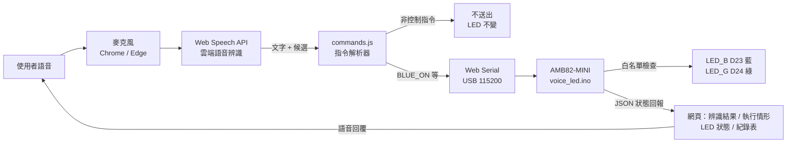
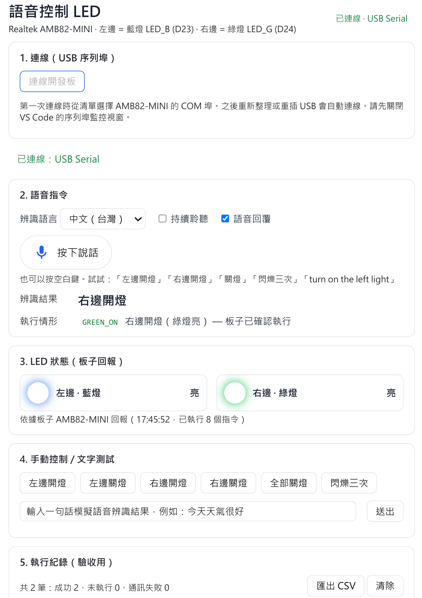
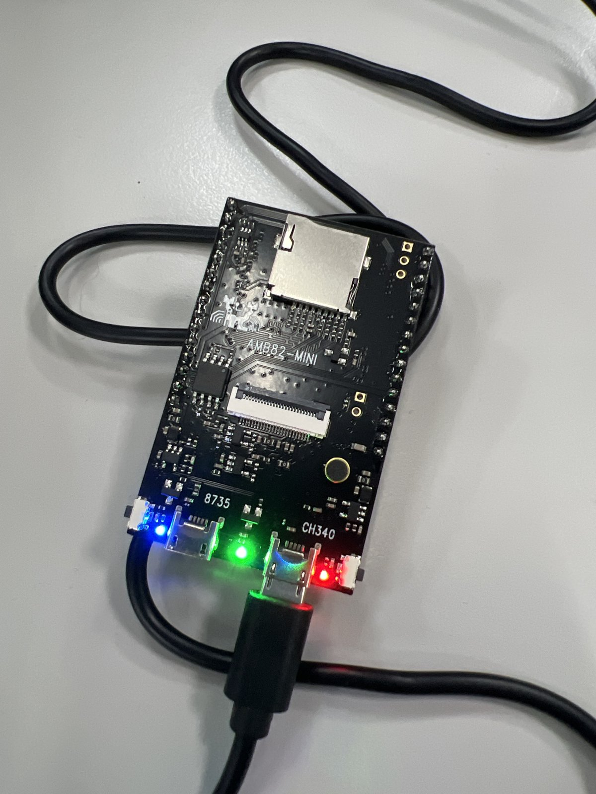

# 運用 Vibe Coding 實作 Ameba Mini 語音控制 LED 系統

- 姓名／學號：【請填寫】
- 示範影片（YouTube）：【請填寫連結】
- 原始程式碼（GitHub）：https://github.com/jerryicyu-ui/voice-led-amb82

> 本草稿標示【請填寫】的地方，都需要依你實際測試、錄影與心得補上，完成後匯出成 PDF。

---

## 一、系統概述

本系統讓使用者對電腦麥克風說出「左邊開燈」或「右邊開燈」，控制 Realtek AMB82-MINI 板上的藍色與綠色 LED。語音辨識在瀏覽器端進行（Web Speech API，實際辨識由雲端服務執行）。辨識出的文字交給指令解析器轉成固定指令，再由瀏覽器透過 USB 序列埠（Web Serial API）送到開發板。開發板執行後回傳 JSON 狀態，網頁上顯示的 LED 狀態一律以這份回報為準。

### 使用的硬體與腳位

| 項目 | 內容 | 確認方式 |
|---|---|---|
| 板卡型號 | Realtek AMB82-MINI（AmebaPro2 / RTL8735B） | 板上絲印；Arduino FQBN `realtek:AmebaPro2:Ameba_AMB82-MINI` |
| 藍燈（左邊） | `LED_B` = `AMB_D23` | Realtek Core `variants/ameba_amb82-mini/variant.h` 第 93 行（Core 4.1.1-build20260915） |
| 綠燈（右邊） | `LED_G` = `AMB_D24` | 同上，第 94 行 |
| 亮滅邏輯 | `digitalWrite(HIGH)` 亮、`LOW` 滅（高電位有效） | 以序列埠送 `BLUE_ON`／`GREEN_ON`／`ALL_OFF` 實測，燈號與板子回報一致 ✅ |

## 二、系統架構圖



> 匯出 PDF 時，若編輯器無法渲染 Mermaid，可將上方程式碼貼到 https://mermaid.live 匯出圖片。

## 三、運作流程說明

### 1. 語音辨識
1. 網頁以 `localhost` 開啟，因為瀏覽器只在安全來源允許使用麥克風。
2. 按下麥克風按鈕後，`SpeechRecognition` 以 `zh-TW`（或 `en-US`）開始錄音，並把聲音送到瀏覽器的雲端辨識服務。
3. 辨識服務回傳最多 3 個候選文字。辨識途中的暫時結果會即時顯示在畫面上。

### 2. 指令解析（`web/commands.js`）
1. **正規化**：去除空白與標點，簡體轉繁體（开→開、灯→燈…），並修正常見誤聽（做邊→左邊、又邊→右邊）。
2. **判斷位置**：左／藍／left／blue 對應藍燈；右／綠／right／green 對應綠燈；全部／兩邊／all 對應兩顆燈。
3. **判斷動作**：閃→閃爍；關／熄／滅／off→關；開／亮／on→開。
4. **安全規則**：含否定詞（不要、別、don't）、同時說開和關、只說開燈但沒指定左右，或完全沒有動作，都**不產生指令**。
5. 只採用辨識信心最高的第一候選；其他候選只顯示在畫面上作為參考，不會執行（原因見第六節問題 5）。

### 3. 指令傳輸（USB 序列埠）
- 瀏覽器透過 Web Serial API 開啟 AMB82-MINI 的 COM 埠（115200 bps），送出一行文字指令，例如 `BLUE_ON\n`。
- 板子回傳一行以 `{` 開頭的 JSON。系統 log 也會印到同一個序列埠，所以前端只讀取以 `{` 開頭的行。
- 指令依序排隊送出，避免兩個指令等待同一個回覆；每個指令最多等 3 秒。網頁另外每 3 秒送一次 `STATUS` 作為心跳檢查。
- 拔掉 USB 線時，瀏覽器會觸發 `disconnect` 事件，網頁立即顯示通訊中斷；重新插上後會觸發 `connect` 事件並自動重新連線。
- **選擇 USB 而非 Wi-Fi 的原因**：不需要設定 Wi-Fi 帳密、查詢 IP，也不受教室網路環境影響（例如需要網頁登入或隔離裝置的校園 Wi-Fi），現場驗收比較穩定。

### 4. LED 控制（`voice_led/voice_led.ino`）
1. `handleCommand()` 只接受白名單內的指令，其他一律回 `ok:false`，LED 不變。
2. 板子用 `blueOn`、`greenOn` 記錄目前狀態，再以 `digitalWrite()` 輸出到 D23／D24。
3. 閃爍使用 `millis()` 的非阻塞狀態機（先滅一拍，再亮滅三次，共 7 步，每步 250 ms），閃完後恢復原本狀態。閃爍期間板子仍然能接收其他指令。
4. 回傳 JSON，例如：`{"ok":true,"cmd":"BLUE_ON","blue":1,"green":0,"blinking":false,"count":5,...}`

### 5. 操作回饋
- 畫面顯示：辨識結果、其他候選、解析出的指令，以及板子是否確認執行。
- LED 狀態只根據板子回傳的 JSON 顯示，並註明回報時間。通訊中斷時改為「未知」，不沿用舊狀態。
- 可開啟語音回覆，例如「好的，左邊開燈」或「通訊失敗，請檢查開發板連線」。

## 四、操作說明

1. 以 USB 線連接 AMB82-MINI 與電腦，到裝置管理員確認 COM 埠編號（本機為 **COM6**，顯示為 `USB-SERIAL CH340`）。
2. 在 VS Code 執行 **Voice LED: Build**，接著讓板子進入燒錄模式（按住 UART_DOWNLOAD → 按 RESET → 放開），再執行 **Voice LED: Upload to COM6**，完成後按 RESET。
3. 確認 VS Code 的序列埠監控視窗已關閉，否則 COM6 會被占用。
4. 執行 **Voice LED: Web UI**，瀏覽器會開啟 `http://localhost:8000/`。
5. 按「連線開發板」，選擇 AMB82-MINI 的 COM 埠，看到右上角顯示「已連線」即可開始。
6. 按麥克風按鈕或空白鍵後說出指令；執行紀錄可匯出成 CSV。



*圖：網頁操作畫面。語音說「右邊開燈」後，辨識結果為「右邊開燈」，送出 `GREEN_ON` 並由板子確認執行；LED 狀態依板子回報顯示藍燈、綠燈皆亮。*



*圖：AMB82-MINI 實際亮燈情形，與上圖網頁回報的狀態一致：左邊藍燈（D23）、右邊綠燈（D24）皆亮；最右側紅燈為電源指示燈。*

## 五、AI 協作紀錄（Vibe Coding）

開發工具：VS Code + Claude Code（AI 程式助理）。以下依時間順序列出關鍵提示詞與 AI 的產出。

### 第 1 輪：提出需求
**提示詞**
> （附上完整作業說明）這是這次的作業，請先看一下專案裡現有的檔案，確認板子型號和 LED 接在哪個腳位，再幫我規劃架構，把韌體和網頁介面做出來。

**AI 的做法與產出**
1. 先讀取專案現有檔案，從 `.vscode/arduino.json` 與 `scripts/amb82.ps1` 確認板卡是 AMB82-MINI，並沿用既有的編譯與燒錄流程。
2. 在 Realtek Core 的 `variant.h` 中找到 `LED_B = AMB_D23`（藍）、`LED_G = AMB_D24`（綠），再參考既有程式碼的寫法，確認 HIGH 為亮。
3. 參考 Core 內附的範例 `WiFi/SimpleHttpWeb/ControlLED.ino`，確認 WiFi API 的用法。
4. 提出架構：瀏覽器語音辨識 → 解析器 → Wi-Fi HTTP（主要）／USB Serial（備用）→ 板子回傳 JSON。
5. 產生 `voice_led.ino`，**第一次編譯即成功**（使用 4,788,224 bytes，約 28%）。
6. 產生前端 `index.html`、`app.js`、`commands.js`、`style.css`、`test.html`，以及 `serve.ps1`。

### 第 2 輪：詢問通訊方式的取捨
**提示詞**
> 現在是用 Wi-Fi 傳指令，如果改成只用 USB 序列埠，會不會比較單純？兩種做法各有什麼優缺點？

**AI 的回答重點**：USB 不需要 Wi-Fi 帳密與 IP，也不受校園網路限制與瀏覽器跨來源權限影響，現場驗收較穩定。缺點是板子必須接著電腦、COM 埠同時只能被一個程式使用，而且拔 USB 線時板子也會斷電。

### 第 3 輪：改為只用 USB
**提示詞**
> 那就改用 USB 吧，請把韌體和網頁裡 Wi-Fi 相關的部分拿掉，只留 USB 序列埠。

**AI 的修改**
1. 韌體移除 WiFi、HTTP 伺服器與 CORS 相關程式，只保留序列埠指令處理，並刪除 Wi-Fi 帳密檔。
2. 網頁移除 Wi-Fi 選項與 IP 欄位。新增功能：自動連線到先前授權過的 COM 埠；拔 USB 時立即顯示通訊中斷，重插時自動重新連線；COM 埠被占用時提示關閉序列埠監控視窗。
3. 重新驗證：韌體編譯成功，解析器測試 30/30 通過，網頁載入沒有 JavaScript 錯誤。

### 第 4 輪：燒錄與實機測試
燒錄韌體後，由 AI 透過序列埠依序送出 `STATUS`、`BLUE_ON`、`GREEN_ON`、`BLINK_ALL`、`HELLO`（錯誤指令）、`ALL_OFF`，我在旁邊觀察 LED 的實際反應。板子回傳的 JSON 全部符合預期，`HELLO` 也被正確拒絕。

### 第 5 輪：修正「閃爍三次只看到兩次」
**提示詞**
> 實際測試閃爍三次，但我只看到閃兩次。會不會是第一次閃之前燈沒有先暗掉，所以第一下看不出來？可以幫我確認並修正嗎？

**AI 的修改**：確認推測正確，將閃爍序列改為「先滅一拍，再亮滅三次」（6 步改成 7 步），重新燒錄後驗證（詳見第六節問題 2）。

### 第 6 輪：網頁語音實測
AI 一步步引導操作：啟動網頁伺服器（遇到 PowerShell 編碼問題並修正，見第六節問題 3）→ 以 Web Serial 連線開發板 → 語音測試左右開燈 → 非控制語句 → 拔 USB 測試通訊中斷與自動重連，全部正常。

### 第 7 輪：制定示範／驗收腳本
**提示詞**
> 幫我寫一份驗收腳本，左右邊開燈、關燈各測一次就好，另外把閃爍三次、英文指令（語言切成 English，說「turn on the left light」）和語音回覆這幾個加分項目也加進去。

**AI 的產出**：`docs/DEMO_SCRIPT.md`，列出 9 個步驟，包含每一步要說的話，以及網頁、LED、語音回覆的預期結果。

### 第 8 輪：依實測紀錄修正解析器
**提示詞**
> （附上網頁匯出的 `voice-led-log-2026-09-29.csv`）這是我實際測試的紀錄，幫我看看哪幾筆的結果不對，找出原因並修正。

**AI 的分析與修改**：正式測試（第 10–20 筆）全部通過；練習時的第 7、8 筆找出兩個解析器問題並修正，詳見第六節問題 5。

## 六、實際遇到的問題與解決

### 問題 1：Wi-Fi 架構太複雜，改為 USB 序列埠（開發過程中實際遇到）
- **現象**：第一版以 Wi-Fi HTTP 為主要通訊方式。但這樣網頁不能放在開發板上：瀏覽器只在 `https` 或 `localhost` 開放麥克風，從 `http://192.168.x.x` 開啟的頁面無法錄音。因此網頁必須放在電腦，再跨來源呼叫板子，連帶要處理 CORS、查 IP、Wi-Fi 帳密，以及教室網路可能擋裝置的風險。
- **與 AI 協作**：詢問 AI「改用 USB 序列埠是否比較單純」，比較兩者的優缺點後，決定只保留 USB。
- **解決**：改用 Web Serial API，讓瀏覽器直接透過 USB 與板子通訊，並移除韌體中所有 Wi-Fi 程式。
- **驗證**：重新編譯韌體、重新執行解析器測試（30/30），並確認網頁沒有錯誤；實機測試結果見第八節。

### 問題 2：「閃爍三次」實際只看到兩次（實機測試發現）
- **現象**：送出 `BLINK_ALL` 時，板子回報執行成功，但肉眼只看到兩次閃爍。
- **分析**：我推測是「第一次閃爍前沒有先暗掉」，詢問 AI 後確認推測正確。閃爍前兩顆燈本來就亮著，而原本程式的第一步是「亮」，所以沒有可見變化：
  ```
  原本：亮(本來就亮) → 滅 → 亮 → 滅 → 亮 → 滅 → 恢復亮   → 肉眼只看到兩次「亮起」
  修正：滅 → 亮 → 滅 → 亮 → 滅 → 亮 → 滅 → 恢復原狀態      → 不論原本亮或滅都看到三次
  ```
- **解決**：把 `blinkStepsLeft` 從 `BLINK_TIMES * 2` 改為 `BLINK_TIMES * 2 + 1`，奇數步為滅、偶數步為亮。
- **驗證**：重新燒錄後，由序列埠依序送出 `ALL_OFF → BLINK_ALL → ALL_ON → BLINK_ALL`，分別測試「燈原本熄滅」和「燈原本亮著」兩種情況，肉眼確認兩種情況都閃三次，閃完也都恢復原狀態（板子回報 `blue`／`green` 與閃爍前相同）。
- **學到的事**：板子回傳 `ok:true` 只代表程式執行了，不代表人眼看到的效果正確；硬體功能一定要實際觀察驗證。

### 問題 3：電腦沒有 Python／Node.js（開發過程中實際遇到）
- **現象**：AI 原本打算用 `python -m http.server` 啟動網頁並執行測試，檢查後發現電腦上的 `python` 只是 Microsoft Store 的捷徑，也沒有安裝 Node.js。
- **解決**：改用 Windows 內建的 PowerShell `HttpListener` 撰寫 `serve.ps1`，不需要安裝任何套件。解析器測試則改以 headless Edge 開啟 `test.html`，再讀取結果。
- **驗證**：headless Edge 執行測試頁，結果為 **30／30 通過**；開啟 `index.html` 也沒有 JavaScript 錯誤。

- **後續問題**：第一次實際執行 `serve.ps1` 時出現語法錯誤 `Unexpected token ')'`。原因是 Windows PowerShell 5.1 會把沒有 BOM 的 UTF-8 檔案當作系統編碼（Big5）讀取，中文註解變成亂碼後破壞了語法。AI 將腳本改為只使用英文，重新執行後確認網頁可以正常載入（HTTP 200）。

### 問題 4：語句同時包含「開」與「關」時提示錯誤（開發過程中實際遇到）
- **現象**：AI 檢查解析器時發現，「左邊開燈右邊關燈」雖然不會被執行（正確），但畫面顯示的原因是「沒有動作」，會誤導使用者。
- **解決**：新增「同時包含開與關，指令不明確」的判斷，並加入對應的測試案例。

### 問題 5：英文語音誤辨識導致錯誤動作（語音實測發現）
- **現象**：練習時匯出的 CSV 出現兩筆錯誤：
  | 紀錄 | 我想說的 | 辨識結果 | 實際執行 | 問題 |
  |---|---|---|---|---|
  | #7 | turn on the left light | turn on the **flashlight** | BLINK_ALL（閃爍） | `flashlight` 含有 `flash`，被當成閃爍 |
  | #8 | turn on the left light | turn on the light light | **GREEN_ON（開錯燈）** | 第一候選沒提到左右，程式改用其他候選（right light）執行 |
- **與 AI 協作**：將匯出的 CSV 交給 AI 分析，AI 對照解析器程式碼找出兩個原因：
  1. 英文判斷用 `/\b(blink|flash)/`，只比對開頭，沒有比對完整單字。
  2. 原本的設計是「第一候選看不懂時，改用其他候選」，想藉此提高辨識率，結果反而拿了錯誤的候選去執行，而且紀錄上顯示的是第一候選，從畫面上看不出原因。
- **解決**：
  1. 英文動作改成完整單字比對（`blink`、`flash`、`flashing`…），`flashlight` 不再符合。
  2. 只採用信心最高的第一候選；其他候選只在畫面上列出，「僅供參考，不會執行」。這更符合作業「無法辨識的語音不應任意改變 LED 狀態」的要求。
- **驗證**：將兩句實測誤辨識結果加入測試案例，`test.html` 為 **33／33 通過**。
- **學到的事**：「盡量猜出使用者意思」和「不要做錯事」是互相衝突的。控制硬體時寧可不執行、請使用者再說一次，也不要執行錯誤的動作。另外，英文的 left light 很容易被聽成 flashlight，示範時可改說「turn on the blue light」。

## 七、如何驗證 AI 產生的程式

1. **對照官方資料**：LED 腳位以 Realtek Core 的 `variant.h` 為準，不直接相信 AI 的記憶。
2. **編譯驗證**：使用 Arduino CLI 與正確的 FQBN 編譯，確認沒有錯誤。
3. **解析器單元測試**：`test.html` 內含 33 個案例，涵蓋正常指令、簡體字、誤聽字、英文、非控制語句、否定句、空字串，以及實測時出現的誤辨識句子，每次修改後重新執行。
4. **韌體單獨測試**：先不經過網頁，直接在序列埠監控視窗輸入 `BLUE_ON`／`GREEN_ON`／`XYZ`／`STATUS`，確認 LED 與 JSON 回報一致、未知指令被拒絕。
5. **整合測試**：依驗收項目實際說話測試，並用紀錄表匯出 CSV 留存證據。
6. **異常測試**：刻意拔掉 USB 線，確認畫面立即顯示通訊中斷、LED 狀態改為「未知」，而且之後的指令會顯示「通訊失敗」；重插後自動恢復連線。

## 八、驗收測試紀錄

依照 `docs/DEMO_SCRIPT.md` 的腳本測試，並同步錄製示範影片。以下資料取自網頁匯出的 `voice-led-log-2026-09-29.csv`（2026-09-29 16:33–16:35，第 10–20 筆）。

| 腳本 | 項目 | 辨識結果 | 送出指令 | 執行結果 | 板子回報狀態 | 是否正確 |
|---|---|---|---|---|---|---|
| 1 | 左邊開燈 | 左邊開燈 | BLUE_ON | 成功 | 藍亮／綠滅 | ✅ |
| 2 | 左邊關燈 | 左邊關燈 | BLUE_OFF | 成功 | 藍滅／綠滅 | ✅ |
| 3 | 右邊開燈 | 右邊開燈 | GREEN_ON | 成功 | 藍滅／綠亮 | ✅ |
| 4 | 右邊關燈 | 右邊關燈 | GREEN_OFF | 成功 | 藍滅／綠滅 | ✅ |
| 5 | 閃爍三次（加分） | 閃爍三次 | BLINK_ALL | 成功 | 閃完恢復藍滅／綠滅 | ✅ |
| 6 | 非控制語句 | 今天天氣很好 | 不送出 | 未執行：非控制指令 | 藍滅／綠滅（不變） | ✅ |
| 7 | 英文指令（加分） | turn on the right light | GREEN_ON | 成功 | 藍滅／綠亮 | ✅ |
| 7 | 英文指令（加分） | turn on the left light | BLUE_ON | 成功 | 藍亮／綠亮 | ✅ |
| 8 | 通訊中斷（拔 USB） | 右邊開燈 | GREEN_ON | 通訊失敗：尚未連接 USB 序列埠（或已中斷） | 未知 | ✅ |
| 9 | 恢復連線後再試 | 右邊開燈 | GREEN_ON | 成功 | 藍滅／綠亮 | ✅ |

- 語音回覆：每一步都有中文或英文的語音回覆【請確認】
- 拔掉 USB 後、切回中文前，曾在英文模式說話，被辨識成「European Hayden」，系統判斷為非控制指令而沒有執行（第 18 筆）。這也說明誤辨識不會改變 LED 狀態。
- 練習階段（第 1–9 筆）另外發現兩個解析器問題，見第六節問題 5。
- 通訊中斷時，板子回報狀態顯示「未知」：網頁不會沿用舊狀態，符合「LED 狀態須以開發板回傳資訊為依據」的要求。

> 現場驗收時，老師會以「左邊開燈」、「右邊開燈」各測試五次，屆時再以網頁的執行紀錄與 CSV 留存結果。

## 九、加分項目

- [x] 閃爍三次（`BLINK_*`，非阻塞，閃完恢復原狀態）
- [x] 中英文指令（zh-TW／en-US 切換，解析器同時支援中英文）
- [x] 語音回覆（`speechSynthesis`，依語言回覆中文或英文）
- [x] 自訂控制介面（連線狀態、LED 狀態燈、手動按鈕、文字模擬、執行紀錄與 CSV 匯出）

## 十、學習心得

【請以自己的話撰寫，建議包含：Vibe Coding 和自己從頭寫程式有什麼不同？哪些地方 AI 做得好、哪些地方需要自己檢查？對語音辨識、網路通訊、嵌入式控制的新理解。】
